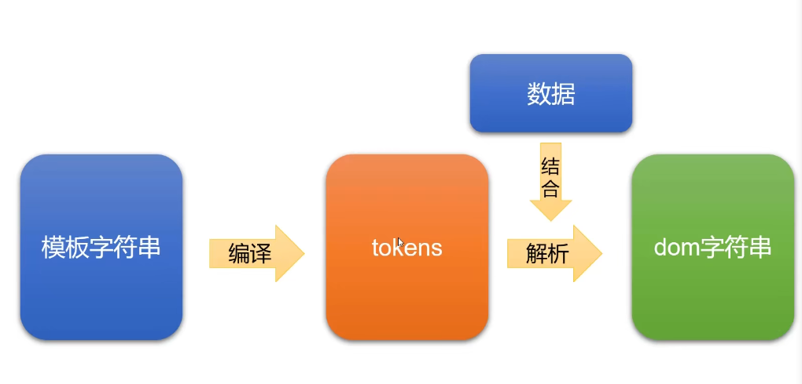
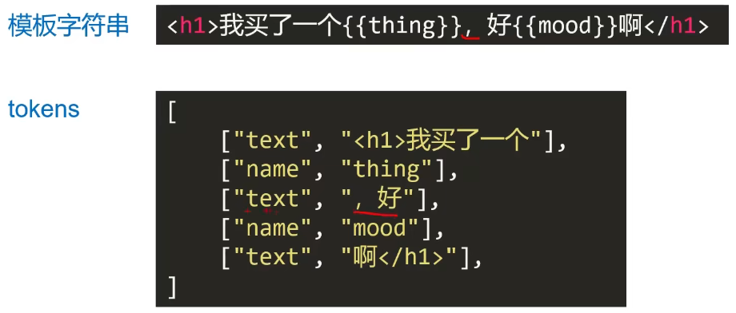
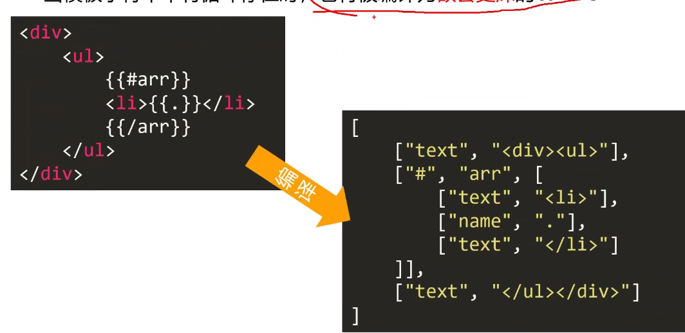

### 数据变为视图的方法

> 纯DOM法: 原生JS的DOM操作

> 数据join法:

```JavaScript
var str = [
  '<li>',
  '  <div class="hd"></div>',
  '</li>',

].join(',')
// 数据字符串拼接后 依赖DOM操作 上树
```

> ES6的反引号法: `${变量}`

> mustache的使用: {{}}

### mustache的实现机理:



①: 将模板字符串编译为tokens形式

②: 将tokens结合数据,解析为dom字符串


### tokens

> 一个JS的嵌套数组,就是模板字符串的JS表示






